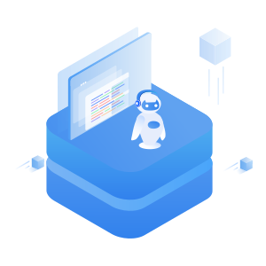

# Web Crafter

<p align="center">
  
  <h1>An extensible lowcode website builder</h1>
</p>

## What is Web Crafter?
Web Crafter is a low-code desktop website building platform aimed to help people who don't know website programming to build their website by drag and drop.


## Tech stacks
The main Tech stacks we are using in this project are listed below:
  - craft.js: An opensource framework for building web builder application
  - material UI: Styling library used for both styling the application and widget in the application
  - Vite: light-weighted frontend react CLI
  - .net: backend framework
  - MongoDB: database used for saving user's website
  - JWT: token based authentication
  - Axios: HTTP client for making API calls
  - Jest: testing framework designed to ensure the correctness of any JavaScript codebase
  - Swagger: Dashboard for managing / testing backend APIs

## Basic & advanced features for this project
project features:
  - [x] Login with Google authentication
  - [x] Provide basic widgets for users to build the website
  - [x] Provide a flexible drag-and-drop feature for people to add and modify the widget for their webpage in canvas
  - [x] Styles and properties of widgets can be modified easily from the settings panel
  - [x] Modifiable and customizable switch/button/chip for multiple usage.
  - [x] support event for some of the widgets (e.g: support on click event on Button)

basic features:
  - Frontend:
    - [x] React using TypeScript
    - [x] Use MaterialUI as the major styling library
    - [x] react-router for routing
    - [x] responsive UI for desktop (NOTE: since Web Crafter is designed for users to design their websites for desktop usage, it is not recommended and not reasonable to make the website responsive for mobile devices, as the screen of the mobile will be too small for users to design their website)  
  - Backend
    - [x] .net as backend
    - [x] EFCore for handling database queries
    - [x] uses NOSQL as the database
    - [x] basic CURD for the user's website

Advanced features:
  - [x] Redux toolkit for state management
  - [x] Containerize the project using Docker
  - [x] Unit testing components
  - [ ] E2E testing with cypress


## Running Project

1. Set up the .net environment, and make sure MongoDB is installed on the computer.

2. run the project:
  - cd to `frontend` folder. Run the command below to start the frontend
  ```bash
  npm install 
  npm run dev
  ```

  - then cd to `backend` folder, run the command below to start the backend
  ```bash
  dotnet build
  dotnet run
  ```

3. open `localhost:5173` in the browser (preferably google chrome)

## Tests

Run `npm test` in the project root to execute the unit tests via [Jest](https://jestjs.io).
